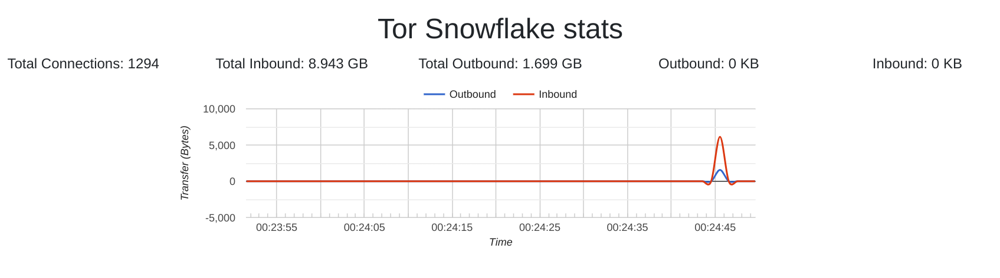

# Snowgauge

A web UI and monitor for Tor Snowflake

**A work in progress**

## Build and run

1. Fork and clone to your local
2. Run `go build ./cmd/snowgauge`
3. Run `./snowgauge`
4. Alternatively run `./snowgauge -help` for more options
5. Open [localhost:8082](localhost:8082) in a WebSocket Browser

## Screenshots

## References

- [Tor Snowflake proxy](https://community.torproject.org/relay/setup/snowflake/)
- [Snowflake source code](https://gitlab.torproject.org/tpo/anti-censorship/pluggable-transports/snowflake)
- [Visualization of real-time data with golang (using WebSocket) by Pratish Bodhale](https://medium.com/@pratishbodhale2/visualization-of-real-time-data-with-golang-with-websocket-bf7a781dffea)
- [Real Time Metrics - Source Code](https://github.com/pratishbodhale/real-time-metrics)
